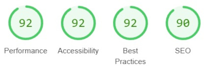
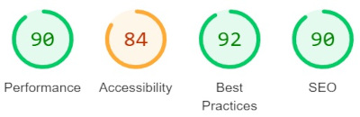
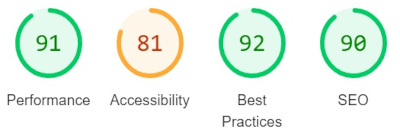
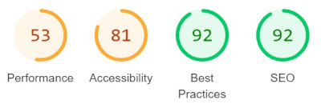

# Performance and Functionality Analysis

In this project, we have conducted several tests to analyze the functionality, performance, and other aspects of our website. Below are the results and corresponding links to the testing tools used.

[Up](#NOM-CONN)
## HTML Checker

- <a href="https://validator.w3.org/nu/?doc=https%3A%2F%2Fescfox.github.io%2FMilestone1%2Findex.html" target="_blank">HTML Checker for index.html</a>
  - Comment: The HTML of the index.html page was validated using the HTML Checker tool. Click the link to view the results.

- <a href="https://validator.w3.org/nu/?doc=https%3A%2F%2Fescfox.github.io%2FMilestone1%2Fservices.html" target="_blank">HTML Checker for services.html</a>
  - Comment: The HTML of the services.html page was validated using the HTML Checker tool. Click the link to view the results.

- <a href="https://validator.w3.org/nu/?doc=https%3A%2F%2Fescfox.github.io%2FMilestone1%2Factivities.html" target="_blank">HTML Checker for activities.html</a>
  - Comment: The HTML of the activities.html page was validated using the HTML Checker tool. Click the link to view the results.

## W3C CSS Validation Service

- <a href="https://jigsaw.w3.org/css-validator/validator?uri=https%3A%2F%2Fescfox.github.io%2FMilestone1%2Findex.html&profile=css3svg&usermedium=all&warning=1&vextwarning=&lang=en" target="_blank">CSS Validation for index.html</a>
  - Comment: The CSS of the index.html page was validated using the W3C CSS Validation Service. Click the link to view the results.

- <a href="https://jigsaw.w3.org/css-validator/validator?uri=https%3A%2F%2Fescfox.github.io%2FMilestone1%2Fservices.html&profile=css3svg&usermedium=all&warning=1&vextwarning=&lang=en" target="_blank">CSS Validation for services.html</a>
  - Comment: The CSS of the services.html page was validated using the W3C CSS Validation Service. Click the link to view the results.

- <a href="https://jigsaw.w3.org/css-validator/validator?uri=https%3A%2F%2Fescfox.github.io%2FMilestone1%2Factivities.html&profile=css3svg&usermedium=all&warning=1&vextwarning=&lang=en" target="_blank">CSS Validation for activities.html</a>
  - Comment: The CSS of the activities.html page was validated using the W3C CSS Validation Service. Click the link to view the results.

## Lighthouse Reports

We have also generated Lighthouse reports using Google DevTools. Click the links below to open the reports in a new tab.

- [Lighthouse Report for Index (Desktop)](./performanceResults/LightHouse_Index_Desktop.jpg)
  - 

- [Lighthouse Report for Index (Mobile)](./performanceResults/LightHouse_Index_Mobile.jpg)
  - 

- [Lighthouse Report for Services (Desktop)](./performanceResults/LightHouse_Services_Desktop.jpg)
  - 

- [Lighthouse Report for Services (Mobile)](./performanceResults/LightHouse_Index_Mobile.jpg)
  - 

- [Lighthouse Report for Activities (Desktop)](./performanceResults/LightHouse_Activities_Desktop.jpg)
  - 

- [Lighthouse Report for Activities (Mobile)](./performanceResults/LightHouse_Activities_Desktop.jpg)
  - 

## Browser Compatibility
The website has had manual and responsive tests conducted on the below browsers:
- Google Chrome
- Mozilla Firefox
- Safari
- Brave
- Microsft Edge